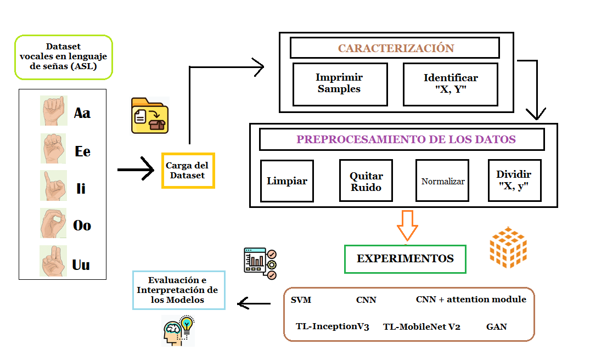

# VisionArtificial: Reconocimiento de las vocales en el lenguaje de señas.

Hoy en día, el lenguaje de señas es una parte única de la comunicación motora humana y es un lenguaje muy complejo, utilizado por diferentes grupos de personas sordas. En nuestro país existen un gran índice de alrededor de (471.205) personas sordo-mudas. Tratar de comunicarse con personas que no conocen el lenguaje de señas se torna muy difícil. Por lo tanto, es importante considerar un modelo basado en ``Computer Vision'' para que el lenguaje de señas pueda actuar como traductor, y así mejorar la comunicación con las personas que no hablan el lenguaje.

En el presente proyecto se desarrollan varios experimentos preliminares para conocer que modelo de Deep Learning es el más óptimo para el reconocimiento de las vocales en el lenguaje de señas (ASL). El objetivo de este estudio práctico es dar a conocer cómo se realiza el preprocesamiento de las imágenes, la estructura y entrenamiento de los modelos de (CNN, TL, GAN , CNN-Attention Module y SVM) con Python. Actualmente, se encuentran realizados los siguientes modelos:
  
  <ul>
  <li>CNN Puro</li>
  <li>CNN con TL MovileNetV2</li>
  <li>CNN con TL InceptionV3</li>
  <li>SVM-Linear Kernel</li>
  <li>CNN-Attention Module</li>
  <li>CNN-GAN</li>
</ul>
   
Para el modelo GAN se hace referencia al siguiente link del drive, en donde se puede visualizar los archivos creados al ejecutar dicho modelo

   
    <ul>
  <li>Archivos resultantes CNN-GAN: https://drive.google.com/drive/folders/1lsiowVq1QTQ4R0Wltd1cg3elCXnpWAq_?usp=sharing/li>
</ul>
   
 
Cabe recalcar, que dichos modelos cuentan con sus respectivas matriz de confusión. La cual es utilizada para estimar el rendimiento del modelo escogido. De este se puede calcular la precisión, y el accurancy.

## Metodología utilizada
En la siguiente Figura se detalla la metodología utilizada para el presente proyecto. Además se adjunta el link del DataSet utilizado:

  
 

  <ul>
  <li>DataSet: https://drive.google.com/drive/folders/1fRR33yztIbWItfLUbf0X2JFUY_LmWqwS?usp=sharing /li>
</ul>
